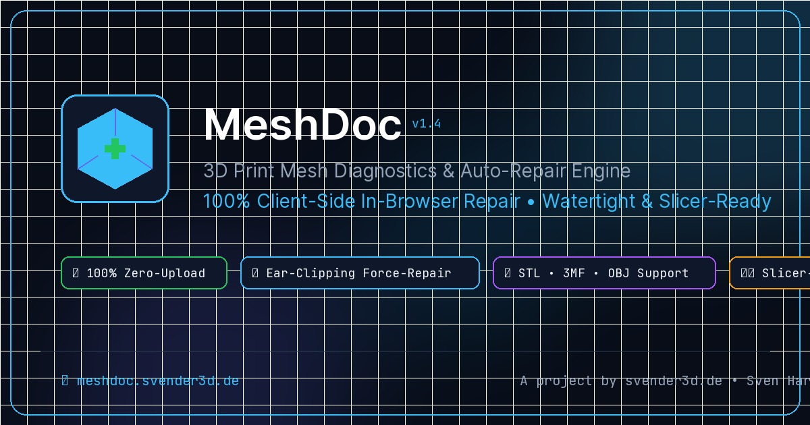

# MeshDoc 🩺 3D Print Mesh Repair & Analyzer

  

> **100% Client-Side 3D Mesh Diagnostics & Auto-Repair Engine for Additive Manufacturing & 3D Printing.**
> Automated repair of broken STL, OBJ, and 3MF files directly in browser memory — Zero-Upload, no cloud dependencies, maximum privacy.

🌐 **Website & Live Tool:** [https://www.meshdoc.de/](https://www.meshdoc.de/)

---

## ✨ Features & Capabilities

### 1. 🔒 100% Zero-Upload & Maximum Privacy (GDPR)
* All file operations (parsing, diagnostics, ear-clipping hole repair, vertex welding, and export) execute strictly **locally inside client browser memory** (`Float32Array`, `Blob`, `ArrayBuffer`).
* No server uploads, no cloud dependencies, and no third-party CDNs (all fonts and Three.js modules are self-hosted).

### 2. 🚀 Zero-Idle GPU & Demand-Driven WebGL Engine (v1.5)
* **0% Idle GPU Utilization:** WebGL rendering loop pauses completely during stationary states, eliminating GPU fan noise, excessive power draw, and screen flickering.
* **Optimized CAD 3-Point Lighting:** Crystal-clear topological inspection without the heavy VRAM depth-pass overhead of dynamic 2048 shadow maps.

### 3. 📊 Two-Phase Vorher/Nachher Comparison Architecture (v1.5)
* **Pre-Repair Inspection:** Shows exact verified vertex/triangle counts and explains precise repair operations.
* **Post-Repair Audit:** Displays full Before ➔ After comparison with exact delta badges (`±Δ`) and verified 100% Watertight / Manifold status.

### 4. ⚡ Deep Multi-Pass Force-Repair Pipeline
* **Remove Redundant CAD Duplicate Faces:** Identifies and cleans overlapping triangles from complex multi-body CAD exports.
* **Planar Ear-Clipping Hole Triangulation:** Reliable closure of open boundary loops and missing surface patches.
* **Topological BFS Surface Normal Alignment:** Consistent outward-facing normal winding propagation across shared edge graphs.
* **Spatial Vertex Welding:** Merges duplicated co-located vertices using a spatial hash table.
* **Sharp CAD Facet Shading:** Recalculates exact face normals for crystal-clear geometry rendering.

### 5. 🔬 Interactive 3D Viewport & Live Laser Hologram Scanner
* **Live 3D Scanning Laser:** Animated visual scanning HUD during the repair process with real-time multi-step progress feedback.
* **Zero-Offset Defect Lines:** Open edges (Red) and non-manifold edges (Yellow) are rigidly parented to the model for perfect alignment.
* **Comparison Modes:** *Original*, *Repaired*, and *Split-View* (Side-by-side pre/post inspection).
* **Bed Alignment Tools:** 1-click drop to build bed (`Z = 0`) and centering on a 220 x 220 mm build plate.
* **Non-Intrusive Sticky Repair Pill:** Floating quick-action button docked at bottom-center when scrolling past the dashboard.
* **Smooth Ease-In-Out Back-To-Top:** High-precision easing navigation (`easeInOutCubic`).

### 4. 📊 Detailed Diagnostics & Interactive Accordions
* Expandable diagnostic cards explaining the **exact root cause in 3D slicers** and the **applied algorithmic solution**.
* Metrics: Triangle count, vertices, dimensions (X × Y × Z in mm), surface area (cm²), and signed volume (cm³).
* **Slicer-Readiness Assessment:** Evaluated for Bambu Studio, OrcaSlicer, PrusaSlicer, and Ultimaker Cura.

### 5. ⚖️ Filament & Material Estimator
* Automatic calculation of model weight (g) and filament length (m) for **PLA, PETG, ABS, and TPU** with customizable infill (0 – 100%).

### 6. 💾 Multi-Format Export
* **Binary STL:** Compact binary STL for all 3D printing slicers.
* **ASCII STL:** Human-readable STL format.
* **3MF:** Modern 3D Manufacturing Format container packaging.
* **Wavefront OBJ:** Universal 3D polygonal geometry.

---

## 📄 License & Credits

Developed by **Sven Harzer** ([svender3d.de](https://www.svender3d.de))  
Licensed under the **MeshDoc Source-Available End-User License** (Free for personal and commercial usage).
